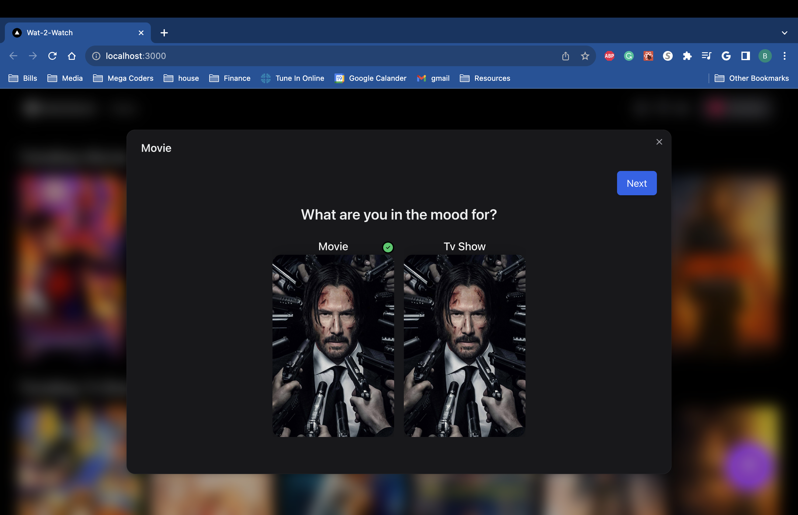
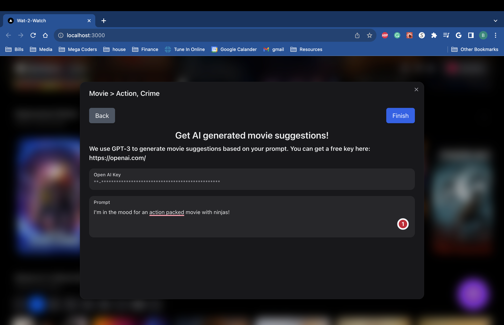
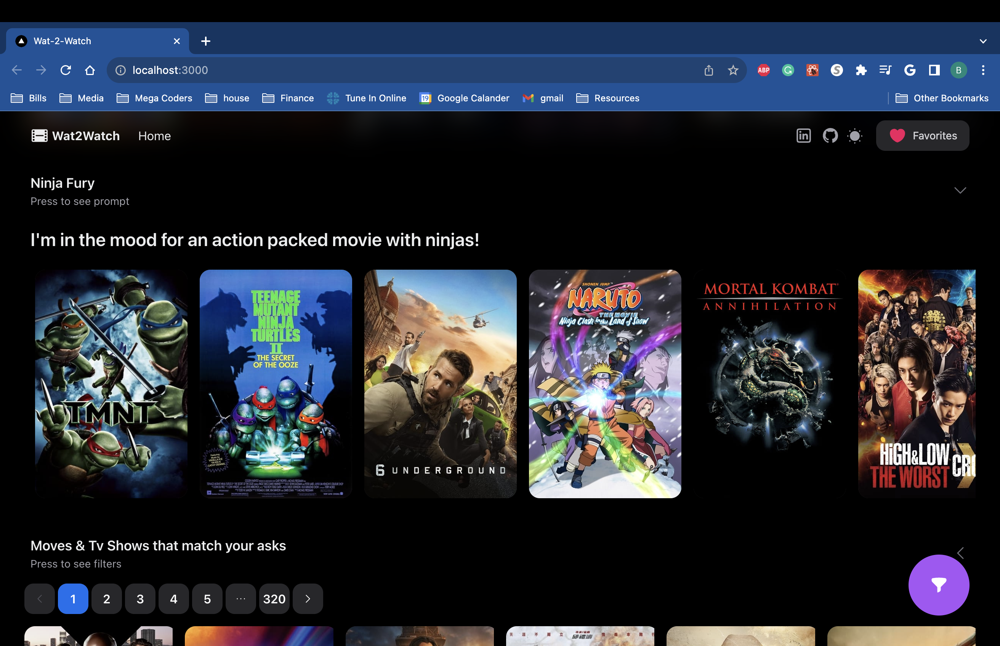
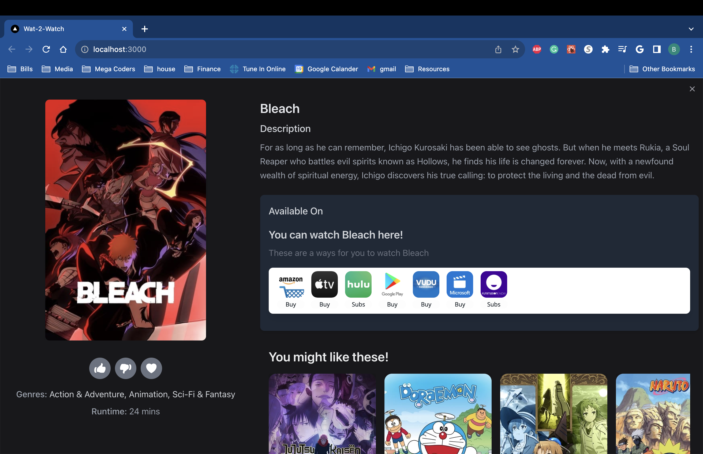

# What 2 Watch

A project i made to help me combat my indecisiveness when it comes to selecting movies.

## Technologies Used

- [Next.js 13](https://nextjs.org/docs/getting-started)
- [NextUI](https://nextui.org)
- [Tailwind CSS](https://tailwindcss.com)
- [Tailwind Variants](https://tailwind-variants.org)
- [TypeScript](https://www.typescriptlang.org)
- [Framer Motion](https://www.framer.com/motion)
- [next-themes](https://github.com/pacocoursey/next-themes)

## Features

### Filter wizard

  

 

  

### Up to date trending movies & tv shows

  

### AI generated movie suggestions

  

### Meta data on media and where to watch!

  

